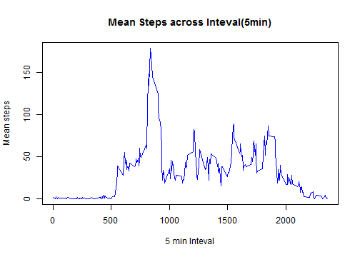
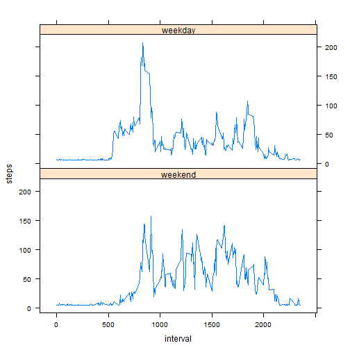

Reproducible Research: Peer Assessment 1
========================================

### Loading and preprocessing the data

First, set english be the system language

```r
Sys.setlocale("LC_TIME", "C")
```

```
## [1] "C"
```

Unzip the data and read it

```r
unzip("activity.zip")
data <- read.csv("activity.csv", header = TRUE)
```

### What is mean total number of steps taken per day?

Remove NAs and calculate the sum steps of each day, and make a histogram of it

```r
subdata <- data[!is.na(data$steps),]

sumsteps_by_date <- tapply(subdata$steps, subdata$date, sum, na.rm = TRUE)
hist(sumsteps_by_date, main="Total number of steps taken each day", breaks = 50,
     xlab = "Total steps of each day")
```

 

Mean of total steps taken per day

```r
mean(sumsteps_by_date, na.rm = TRUE)
```

```
## [1] 10766
```

Median of total steps taken per day 

```r
median(sumsteps_by_date, na.rm = TRUE)
```

```
## [1] 10765
```

## What is the average daily activity pattern?

Aggregate mean steps by the inteval colomn, make a plot

```r
meansteps_by_intv <- aggregate(.~interval, FUN=sum, data=subdata)
meansteps_by_intv$steps <- meansteps_by_intv$steps / length(levels(subdata$date))
plot(meansteps_by_intv$interval, meansteps_by_intv$steps, type="l", 
     col = "blue", main="Mean Steps across Inteval(5min)", xlab="5 min Inteval",
     ylab="Mean steps" )
```

 

Calculate the interval which contains the maximum number of steps

```r
maxmeanindex <- which.max(meansteps_by_intv$steps)
meansteps_by_intv[maxmeanindex, 1]
```

```
## [1] 835
```

### Imputing missing values

Calculate the count of rows which contain NAs

```r
na_flag <- is.na(data$steps)
na_flag <- as.numeric(na_flag)
na_count <- sum(na_flag)
```
So, the count is 2304

Use the mean value of steps to fill all NAs, the new dataframe is called data_imputed

```r
mean <- mean(data$steps, na.rm = TRUE)
steps_imputed <- replace(data$steps, is.na(data$steps),mean)
data_imputed <- data.frame(steps_imputed, data$date, data$interval)
str(data_imputed)
```

```
## 'data.frame':	17568 obs. of  3 variables:
##  $ steps_imputed: num  37.4 37.4 37.4 37.4 37.4 ...
##  $ data.date    : Factor w/ 61 levels "2012-10-01","2012-10-02",..: 1 1 1 1 1 1 1 1 1 1 ...
##  $ data.interval: int  0 5 10 15 20 25 30 35 40 45 ...
```

Make a histogram of the total number of steps taken each day in the newly imputed dataset

```r
sumsteps_by_date_imputed <- aggregate(.~data.date, FUN=sum, data = data_imputed)
hist(sumsteps_by_date_imputed$steps, main="Total number of steps taken each day", breaks = 50,
     xlab = "Total steps of each day")
```

 

Mean of total steps taken per day in imputed dataset

```r
mean(sumsteps_by_date_imputed$steps_imputed, na.rm = TRUE)
```

```
## [1] 10766
```

Median of total steps taken per day in imputed dataset

```r
median(sumsteps_by_date_imputed$steps_imputed, na.rm = TRUE)
```

```
## [1] 10766
```

Mean value doesn't change while median value became larger.
We can see that the imputed computation actually add more the instances with the mean values, thus change the median value.

### Are there differences in activity patterns between weekdays and weekends?

Add a column indicating whether the date is a weekday or weekend day

```r
new_data <- transform(data_imputed, weekend=as.POSIXlt(data.date, format='%Y-%m-%d')$wday)  
new_data$weekend <- replace(new_data$weekend, new_data$weekend %in% c(0,6), "weekend")
new_data$weekend <- replace(new_data$weekend, new_data$weekend %in% c(1,2,3,4,5), "weekday")
names(new_data) <- c("steps", "date", "interval", "weekend")
new_data <- transform(new_data, weekend = as.factor(weekend))
str(new_data)
```

```
## 'data.frame':	17568 obs. of  4 variables:
##  $ steps   : num  37.4 37.4 37.4 37.4 37.4 ...
##  $ date    : Factor w/ 61 levels "2012-10-01","2012-10-02",..: 1 1 1 1 1 1 1 1 1 1 ...
##  $ interval: int  0 5 10 15 20 25 30 35 40 45 ...
##  $ weekend : Factor w/ 2 levels "weekday","weekend": 1 1 1 1 1 1 1 1 1 1 ...
```

Use lattice plotting system to Make a panel plot containing a time series plot (i.e. type = "l") of the 5-minute interval (x-axis) and the average number of steps taken, averaged across all weekday days or weekend days (y-axis).

```r
weekEnd <- subset(new_data, weekend == "weekend")
weekEndMean <- aggregate(steps~interval,data = weekEnd, sum)
weekEndMean$steps <- weekEndMean$steps / length(levels(as.factor(as.Date(weekEnd$date))))
weekDay <- subset(new_data, weekend == "weekday")
weekDayMean <- aggregate(steps~interval, data = weekDay, sum)
weekDayMean$steps <- weekDayMean$steps / length(levels(as.factor(as.Date(weekDay$date))))

new_meanstep_by_intv <- rbind(data.frame(weekEndMean,weekend=rep("weekend", times=288)),data.frame(weekDayMean,weekend=rep("weekday", times=288)))
new_meanstep_by_intv$weekend <- as.factor(new_meanstep_by_intv$weekend)

library(lattice)
xyplot(steps ~ interval | weekend, data = new_meanstep_by_intv, layout = c(1, 2)
       , type = "l")
```

 
